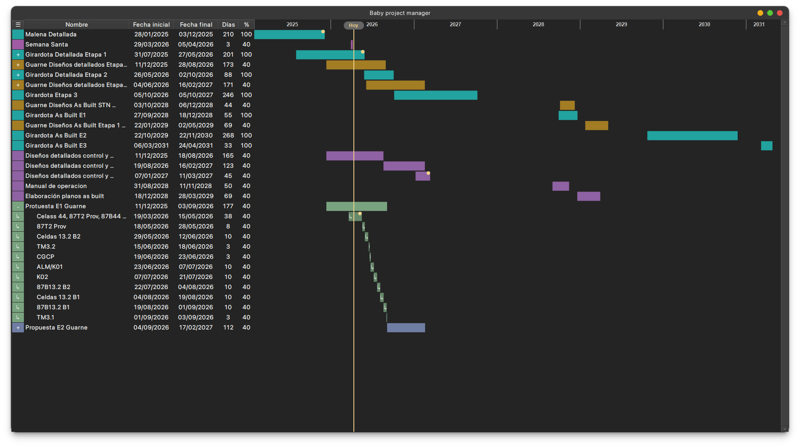
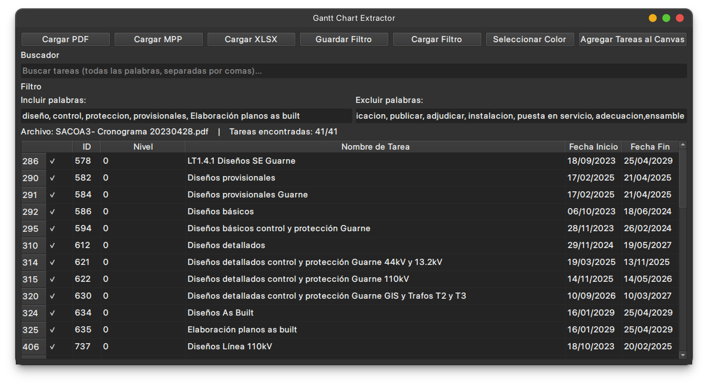

# Baby Project Manager

[](https://github.com/Rudull/baby-project-manager/releases)
[](LICENSE)
[](https://www.python.org/)

**Baby Project Manager** es una herramienta para la gestión de proyectos y creación de diagramas de Gantt. Diseñada para ofrecer una experiencia intuitiva, permite organizar, visualizar y programar tareas de manera profesional sin complicaciones.

---

## Propuesta de Valor

Baby Project Manager se destaca por su ligereza y enfoque en lo esencial:
- **Claridad Visual**: Diagramas de Gantt interactivos sincronizados con la lista de tareas.
- **Interoperabilidad**: Importación desde Microsoft Project (.mpp), Excel (.xlsx) y PDF.
- **Control Total**: Sistema completo de Deshacer/Rehacer (Undo/Redo) y alertas de hitos.
- **Localización**: Soporte nativo para festivos de Colombia: destacados en la vista de calendario, resaltados en rojo en los popups de selección de fechas, y considerados en el cálculo de días hábiles restantes.

---

## Vista Previa

### Interfaz Principal


### Importación de Cronogramas


---

## Características Principales

- **Gestión Jerárquica**: Creación de tareas y subtareas con niveles de indentación.
- **Diagramas de Gantt Dinámicos**: Zoom (Ctrl+Scroll), desplazamiento horizontal (Shift+Scroll), hoy siempre visible y anclado durante zoom, vistas personalizadas (Completa, Año, 6/3/1 mes), y **persistencia del nivel de zoom** entre sesiones.
- **Interfaz Persistente**: La aplicación recuerda la posición y tamaño de la ventana, estado maximizado, nivel de zoom del Gantt, y modo de vista del calendario (mes/año) al cerrar y abrir nuevamente.
- **Formatos Soportados**:
  - **Nativo**: .bpm (eficiente).
  - **Importación**: .mpp, .xlsx, .pdf.
  - **Exportación**: Excel y PDF.
- **Sistema de Alertas**: Recordatorios por tarea y alertas globales de vencimiento.
- **Personalización**: Colores por tarea, notas con hipervínculos y temas claro/oscuro.
- **Productividad**: Atajos de teclado y menús contextuales rápidos.

---

## Instalación y Configuración

### 1. Clona el repositorio
```bash
git clone https://github.com/Rudull/baby-project-manager
```

### 2. Configura el entorno (Recomendado: Conda/Anaconda)
Este proyecto utiliza librerías de Java y Qt, por lo que Conda es la forma más sencilla de gestionar todas las dependencias:

```bash
# Crear el entorno desde el archivo de configuración
conda env create -f environment_windows.yaml

# Activar el entorno
conda activate baby
```

*Nota: La configuración de Conda ya incluye el JDK de Java necesario para desarrollo.*

### 3. Configura los secretos
- Copia `.env.example` como `.env` y añade tu URL de Webhook de Discord para habilitar los reportes directos desde la app. Esto es necesario tanto para desarrollo como para que el ejecutable compilado tenga soporte de reportes.

### 4. Ejecuta la aplicación
```bash
python src/main.py
```

---

## Generación del Ejecutable (Build)

Baby Project Manager soporta dos compiladores con diferente comportamiento:

### Opción 1: Nuitka (Recomendado)

Produce código C compilado nativo con menos falsos positivos de antivirus:

```powershell
conda activate baby
python build_system/build_nuitka_windows.py --clean
```

### Opción 2: PyInstaller (Alternativo)

Empaquetador tradicional de bytecode Python:

```powershell
conda activate baby
python build_system/build_pyinstaller_windows.py --clean
```

### Compilación Interactiva (Recomendada)

Menú automático que permite elegir compilador, formato de salida y opciones:

```powershell
conda activate baby
python build_system/build_to_distribution.py
```

Esta es la forma recomendada para generar una distribución lista para desplegar.

**Importante para el Usuario Final:**
El archivo `.exe` generado requiere:
1. **Visual C++ Redistributable 2015-2022**: [Descargar](https://aka.ms/vs/17/release/vc_redist.x64.exe) (crítico para ejecutar la aplicación)
2. **Java JDK** instalado y configurado en el `PATH` (para abrir archivos de Microsoft Project .mpp)

Consulta [docs/Configuracion de entorno virtual de Java.txt](docs/Configuracion de entorno virtual de Java.txt) para más detalles sobre la configuración de Java.

---

## Reporte de Problemas

La aplicación incluye un sistema dual para reportar errores:
- **GitHub Issues**: Para usuarios con cuenta de GitHub.
- **Reporte Directo (Discord)**: Envío de reportes anónimos directamente desde la aplicación (requiere que el `.env` esté presente al momento de compilar).

---

## Requisitos del Sistema

- **Python 3.11+** (Recomendado)
- **Java JDK 17+** 
  - Para desarrollo: Incluido en el entorno Conda.
  - Para el Ejecutable: Instalación global en Windows requerida.
- **Bibliotecas principales**: PySide6, pandas, openpyxl, mpxj, jpype1, workalendar.

---

## Documentación

- **[BUILD.md](BUILD.md)** — Guía completa de compilación y distribución
- **[STRUCTURE.md](STRUCTURE.md)** — Arquitectura detallada del proyecto
- **[COMMANDS.md](COMMANDS.md)** — Sistema de Deshacer/Rehacer

---

## Contribuciones

Las contribuciones son bienvenidas. Si desea mejorar la aplicación o añadir formatos de importación, puede abrir un Pull Request o un Issue.

---

## Licencia

Este proyecto está bajo la licencia **GNU General Public License v3.0**. Ver el archivo [LICENSE](LICENSE) para más detalles.

---

**Desarrollado por [Rafael Hernández Bustamante](https://www.linkedin.com/in/rafaelhernandezbustamante)**
